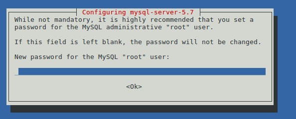

# Konfiguracja środowiska projektu

## Spis treści

1. [Środowisko konfigurowanego systemu](#Środowisko-konfigurowanego-systemu)
2. [Konfiguracja środowiska](#Konfiguracja-środowiska)

  1. [Linux](Linux)
  2. [Windows](Windows)

## Środowisko konfigurowanego systemu

1. Linux Mint 18.1 x64
2. Apache 2.4.18 (Ubuntu)
3. MySQL Server 5.7
4. PHP 7.

## Konfiguracja środowiska

### Linux

1. Wstępne konfiguracja systemu.

  * Dobrze, aby zainstalowana dystrybucja linuxa była pochodną Debiana.
  * Warto zadbać o zaszyfrowanie folderu domowego użytkownika.


2. Uruchom terminal, aby uruchomić w nim polecenia z kolejnych punktów.

2. Aktualizacja repozytoriów.

  ```
  sudo apt update
  ```

3. Instalacja serwera HTTP Apache.

  ```
  sudo apt install apache2
  ```

  Aby zweryfikować poprawność instlacji wywołaj:

  ```
  apache2 -v
  ```

  Powinna zostać wyświetlona analogiczna treść:

  ```
  Server version: Apache/2.4.18 (Ubuntu)
  Server built:   2016-07-14T12:32:26
  ```

4. Instalacja serwera baz danych MySQL.

  ```
  sudo apt install mysql-server
  ```

  Podczas instalacji mysql-server w konsoli pojawi się okienko konfiguracji hasła dla użytkownika root:

    

    i kolejno potwierdzenia tego hasła:

    .

  Aby zweryfikować poprawność instlacji wywołaj:

  ```
  mysql -u root -p
  ```

  I wprowadź swoje hasło, powinna pojawić się analogiczna treśc z uruchomiona konsolą `mysql>`

  ```
  Welcome to the MySQL monitor.  Commands end with ; or \g.
  Your MySQL connection id is 13
  Server version: 5.7.16-0ubuntu0.16.04.1 (Ubuntu)

  Copyright (c) 2000, 2016, Oracle and/or its affiliates. All rights reserved.

  Oracle is a registered trademark of Oracle Corporation and/or its
  affiliates. Other names may be trademarks of their respective
  owners.

  Type 'help;' or '\h' for help. Type '\c' to clear the current input statement.

  mysql>
  ```

  Aby zamknąc konsole mysql wpisz: `exit`

5. Instalacja memcached.

  ```
  sudo apt install memcached
  ```

  Źródło: [How To Install and Use Memcache on Ubuntu 14.04](https://www.digitalocean.com/community/tutorials/how-to-install-and-use-memcache-on-ubuntu-14-04)

  Weryfikacja instalacja nastąpi podczas weryfikacji instalacji PHP.

6. Instalacja PHP wraz z listą modułów.

  ```
  sudo apt install php libapache2-mod-php php-cli php-mcrypt php-curl php-intl php-dom php-mysql php-mysqli php-mbstring php-xml php-simplexml php-gd php-xdebug php-memcached
  ```

7. Zmiany w konfiguracji PHP.

  1. Otwórz plik: `/etc/php/7.0/apache2/php.ini`
  2. Zmienić poniższe linijki:
    * Na serwerze produkcyjnym ustawić: `expose_php = Off`
    * Zwiększenie pamięci operacyjnem dostępenej dla PHP: `memory_limit = 1024M`
    * Zwiększ maksymalną wielkość wysyłanych plików: `upload_max_filesize = 64M`

8. Skonfigurowanie katalogu `www` z uprawnieniami grupy `www-data` wewnątrz katalogu użytkownika.

  1. Poniższe polecenia przechodzą do katalogu `~/` i tworzą w nim katalog `www` wraz z podkatalogami `log` oraz `localhost`. Odpowiednio w pierwszym będą przechowywane logi domen dodanych w katalogu `/etc/apache2/sites-available`, a w drugim pliki dla domeny `localhost`. Katalogi zostaną dodane do grupy www-data.
  * TODO  

  ```
  cd ~/
  mkdir www
  sudo chgrp www-data www
  ```

  2. Utwórz katalog do przechowywania logów Apache'a.

  ```
  cd ~/
  mkdir www
  cd ~/www
  mkdir log
  mkdir localhost
  cat << EOF > ./localhost/index.php
  #!/usr/bin/env php
  <?php
    phpinfo();
  EOF
  cd ..
  sudo chgrp www-data -R www
  cd /etc/apache2/sites-available
  sudo sed -e "s@/var/www/html@$HOME/www/localhost@g" 000-default.conf
  sudo sed -e "s@\${APACHE_LOG_DIR}@$HOME/www/log@g" 000-default.conf
  sudo service apache2 restart
  ```

  3. Utwórz katalog dla domeny localhost, a następnie utwórz w nim

9. Ustawienie

7. Instalacja wtyczki do Xdebuga w przeglądarce.

  Zainstaluj rozszerzenie do chroma z poniższego linku.
  [Xdebug helper](https://chrome.google.com/webstore/detail/xdebug-helper/eadndfjplgieldjbigjakmdgkmoaaaoc?utm_source=chrome-app-launcher-info-dialog)

7. Uruchomienie modułów apache.

  ```
  sudo a2enmod rewrite
  ```

8. Przygotuj folder w katalogu domowym użytkownika, zostanie on dodany do zmiennych środowiskowych użytkownnika. A w nim zostaną zainstalowane aplikacje composer oraz webdriver.
  * W moim przypadku jest to katalog `~/bin`
  * Jeśli masz już przygotowany katalog, otwórz plik ``~/.profile` i dodaj na końcu poniższy kod:
  ```
  # set PATH so it includes user's private bin if it exists
  if [ -d "$HOME/bin" ] ; then
  	PATH="$HOME/bin:$PATH"
  fi
  ```

9. Przejdź do przygotowanego katalogu.

  ```
  cd ~/bin
  ```

10. Instalacja composera.

  * Wykonaj poniższy kod w terminalu. W razie zmiany hashu potwierdzającego oryginalność paczki skorzystaj z kodu dostępnego w źródle.
  ```
  php -r "copy('https://getcomposer.org/installer', 'composer-setup.php');"
  php -r "if (hash_file('SHA384', 'composer-setup.php') === '61069fe8c6436a4468d0371454cf38a812e451a14ab1691543f25a9627b97ff96d8753d92a00654c21e2212a5ae1ff36') { echo 'Installer verified'; } else { echo 'Installer corrupt'; unlink('composer-setup.php'); } echo PHP_EOL;"
  php composer-setup.php
  php -r "unlink('composer-setup.php');"
  mv composer.phar composer
  ```
  Źródło: [getcomposer.org/download/](https://getcomposer.org/download/)

11. Dodanie aplikacji globalnych użytkownika zainstalowanych w kompoterze do listy ścieżek systemowych.
  * Otwórz plik `~/.profile`
  * Dodaj na końcu poniższy kod:
  ```
  # set PATH so it includes user's private composer bin if it exists
  if [ -d "$HOME/.composer/vendor/bin" ] ; then
      PATH="$HOME/.composer/vendor/bin:$PATH"
  fi
  ```

12. Odśwież ustawienia profilu (Dzięki temu będziesz mógł bez ponownego logowania do systemu skorzystać z aplikacji umieszczonych w podpiętych folderach do pliku ~/.profile).

  ```
  source ~/.profile
  ```

13. Instalacja composer-asset-plugin, umożliwa wykorzystanie paczek z NPM i Bowera.

  ```
  composer global require "fxp/composer-asset-plugin:^1.2.0"
  ```
  Plugin jesy wymagany przez framework Yii2.

  Źródło: [yiiframework.com/download](http://www.yiiframework.com/download/)

14. Instalacja codeception (w tym phpunit).

  ```
  composer global require --dev "codeception/codeception:*" "codeception/specify:*" "codeception/verify:*"
  ```
  Żródło: [codeception.com/quickstart](http://codeception.com/quickstart)

15. Instalcja selenium server standalone.

  1. Zainstaluj Oracle Java.
  ```
  sudo add-apt-repository ppa:webupd8team/java
  sudo apt update
  sudo install oracle-java8-installer
  ```
    * Źródło: [launchpad.net/~webupd8team/+archive/ubuntu/java](https://launchpad.net/~webupd8team/+archive/ubuntu/java)
    * Źródło: [How to install Oracle Java on Ubuntu 14.04? [duplicate]](http://askubuntu.com/questions/521145/how-to-install-oracle-java-on-ubuntu-14-04)

  2. krokiem jest pobranie paczki JAR z poniższego linku:

  [seleniumhq.org/download/](http://www.seleniumhq.org/download/)

  3. Przenieś plik `selenium-server-standalone-x.x.x.jar` do katalogu `~/bin` i zmień jego nazwę na `selenium-server.jar`.
  4. Upewnij się, że jesteś w katalogu `~/bin` i wykonaj poniższy kod:
  ```
  cat << EOF > selenium-server
  #!/bin/bash
  java -jar ~/bin/selenium-server.jar
  EOF
  chmod 755 selenium-server
  ```

16. Instalacja Webdriver.

  1. Pobierz i zainstaluj Google Chrome (nie chromium-browser!).

  [Google Chrome download](https://www.google.com/chrome/browser/desktop/index.html)

  2. Pobierz i rozpakuj chromeserver do katalogu `~/bin`.

  [sites.google.com/a/chromium.org/chromedriver/downloads](https://sites.google.com/a/chromium.org/chromedriver/downloads)

  Źródło: [github.com/SeleniumHQ/selenium/wiki/ChromeDriver](https://github.com/SeleniumHQ/selenium/wiki/ChromeDriver)

  3. Nastepnie użyj poniższych poleceń:
  ```
  chmod 755 chromedriver
  source ~/.profile
  ```

16. Instalacja generatora ApiDoc.

  * TODO

17. Instalacja Postmana.

  * TODO

18.

## Windows

# Instalacja LAMP

# Źródła

* Konfigruacja LAMP - [How To Install Linux, Apache, MySQL, PHP (LAMP) stack on Ubuntu](https://www.digitalocean.com/community/tutorials/how-to-install-linux-apache-mysql-php-lamp-stack-on-ubuntu), uwaga w kroku 2 w instalacji MySQL pojawia się paczka `libapache2-mod-auth-mysql`, aktualnie nie jest ona już wspierana [mod-auth-mysql](https://launchpad.net/ubuntu/+source/mod-auth-mysql/+publishinghistory),
