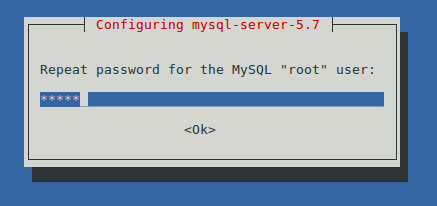

# Konfiguracja środowiska projektu projektu

## Spis treści

1. [En]
2. [Coding style](Style/)

## Środowisko konfigurowanego systemu

1. Linux Mint 18.1 x64
2. Apache 2.4.18 (Ubuntu)
3. MySQL Server 5.7
4. PHP 7.

## Środowisko

### Linux

1. Wstępne konfiguracja systemu.
  * Dobrze, aby zainstalowana dystrybucja linuxa była pochodną Debiana.
  * Warto zadbać o zaszyfrowanie folderu domowego użytkownika.


2. Uruchom terminal i używaj

2. Aktualizacja repozytoriów.

  ```
  sudo apt update
  ```

3. Instalacja serwera HTTP Apache.

  ```
  sudo apt install apache2
  ```

4. Instalacja serwera baz danych MySQL.

  ```
  sudo apt install mysql-server
  ```

5. Podczas instalacji mysql-server w konsoli pojawi się okienko konfiguracji hasła dla użytkownika root:

  

  i kolejno potwierdzenia tego hasła:

  .

6. Instalacja PHP wraz z listą modułów.

  ```
  sudo apt install php libapache2-mod-php php-cli php-mcrypt php-curl php-intl php-dom php-mysql php-mysqli php-mbstring php-xml php-simplexml php-gd php-xdebug
  ```

7. Uruchomienie modułów apache.

  ```
  sudo a2enmod rewrite
  ```

8. Instalacja composera.

  ```
  php -r "copy('https://getcomposer.org/installer', 'composer-setup.php');"
  php -r "if (hash_file('SHA384', 'composer-setup.php') === '61069fe8c6436a4468d0371454cf38a812e451a14ab1691543f25a9627b97ff96d8753d92a00654c21e2212a5ae1ff36') { echo 'Installer verified'; } else { echo 'Installer corrupt'; unlink('composer-setup.php'); } echo PHP_EOL;"
  php composer-setup.php`
  php -r "unlink('composer-setup.php');"
  ```
  Źródło: [getcomposer.org/download/](https://getcomposer.org/download/)

  Instalcja composer.phar dla lokalnego użytkownika -> .bashrc

9. Instalacja codeception.

10. Instalacja phpunit.

## Windows

# Instalacja LAMP

# Źródła

* Konfigruacja LAMP - [How To Install Linux, Apache, MySQL, PHP (LAMP) stack on Ubuntu](https://www.digitalocean.com/community/tutorials/how-to-install-linux-apache-mysql-php-lamp-stack-on-ubuntu), uwaga w kroku 2 w instalacji MySQL pojawia się paczka `libapache2-mod-auth-mysql`, aktualnie nie jest ona już wspierana [mod-auth-mysql](https://launchpad.net/ubuntu/+source/mod-auth-mysql/+publishinghistory),
